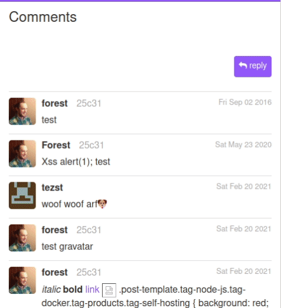
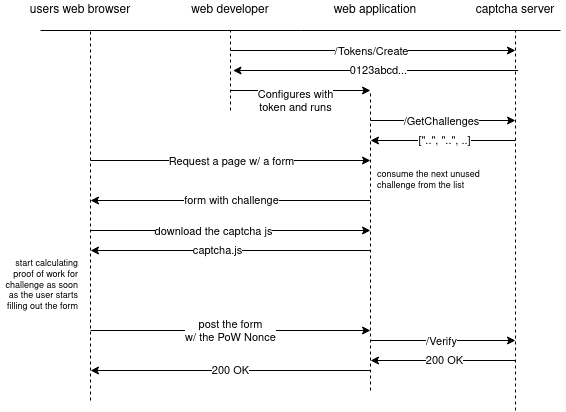
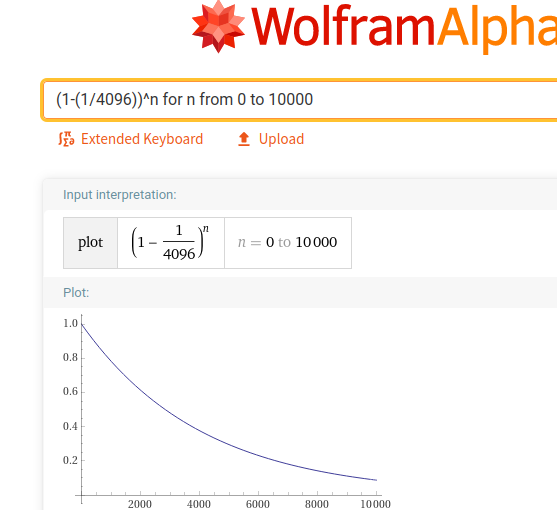

# 💥PoW! Captcha

A proof of work based captcha similar to [friendly captcha](https://github.com/FriendlyCaptcha/friendly-challenge), but lightweight, self-hosted and Affero GPL licensed. All dependencies are included, total front-end unminified gzipped file size is about 50KB.




# How it works 

This application was designed to be a drop-in replacement for ReCaptcha by Google. It works pretty much the same way;

 1. Your web application requests a captcha (in this case, a batch of captchas) from the captcha HTTP API
 2. Your web application displays an HTML page which includes a form, and passes the captcha data to the form
 3. The HTML page includes the JavaScript part of the Captcha app, this JavaScript draws the Captcha on the page  
 4. When the Captcha is complete, its JavaScript will fire off a callback to your JavaScript (usually used to enable the submit button on the form)
 5. When the form is submitted, your web application submites the captcha result to the captcha HTTP API for validation

# What is Proof of Work? 

Proof of Work (PoW) is a scheme by which one computer can prove to another that it expended a certain amount of computational effort. 

PoW does not require any 3rd party or authority to enforce rules, it is based on mathematics and the nature of the universe.

PoW works fairly well as a deterrent against spam, a PoW requirement makes sending high-volume spam computationally expensive.

It is impossible to predict how long a given Proof of Work will take to calculate. It could take no time at all (got it on the first try 😎 ), or it could take an abnormally long time (got unlucky and took forever to find the right hash 😟 ). You can think of it like flipping coins until you get a certain # of heads in a row.  This **DOES** matter in terms of user interface and usability, so you will want to make sure that the difficulty is low enough that users are extremely unlikely to be turned away by an unlucky "takes forever" captcha.

If you want to read more or see a concrete example, see [What is Proof of Work? Extended Concrete Example](#what-is-proof-of-work-extended-concrete-example) at the bottom of this file.

# Sequence diagram



This diagram was created with https://app.diagrams.net/.
To edit it, download the <a download href="readme/sequence.drawio">diagram file</a> and edit it with the https://app.diagrams.net/ web application, or you may run the application from [source](https://github.com/jgraph/drawio) if you wish.

# HTTP API

#### `POST /GetChallenges?difficultyLevel=<int>`

Return type: `application/json` 

`GetChallenges` returns a JSON array of 1000 strings. The Captcha server will remember each one of these challeges until it is 
restarted, or until GetChallenges has been called 10 more times. Each challenge can only be used once.

The difficultyLevel parameter specifies how many bits of difficulty the challenges should have.
Each time you increase the difficultyLevel by 1, it doubles the amount of time the Proof of Work will take on average.
The recommended value is 8. A difficulty of 8 will be solved quickly by a laptop or desktop computer, and solved within 60 seconds or so by a cell phone.


#### `POST /Verify?challenge=<string>&nonce=<string>`

Return type: `text/plain` (error/status messages only)

`Verify` returns HTTP 200 OK only if all of the following are true:

  - This challenge was returned by `GetChallenges`.
  - `GetChallenges` hasn't been called 10 or more times since this challenge was originally returned.
  - Verify has not been called on this challenge before.
  - The provided hexadecimal nonce solves the challenge.

Otherwise it returns 404, 400, or 500.


#### `GET /static/<filename>`

Return type: depends on file

Files:
  
  - captcha.js
  - captcha.css
  - proofOfWorker.js

You only need to include `captcha.js` in your page, it will pull in the other files automatically.
See below for a more detailed implementation walkthrough.


# HTML DOM API

In order to set up 💥PoW! Captcha on your page, you just need to load/include `captcha.js` and one or more html elements 
with all 3 of the following properties:

#### `data-sqr-captcha-url`

This is the base url from which `captcha.js` will attempt to load additional resources `captcha.css` and `proofOfWorker.js`.

#### `data-sqr-captcha-challenge`

This is one of the challenge strings returned by `GetChallenges`. It must be unique, each challenge can only be used once.

#### `data-sqr-captcha-callback`

This is the name of a function in the global namespace which will be called & passed the winning nonce once the Proof of Work 
is completed. So, for example, if you had:

`<div ... data-sqr-captcha-callback="myCallbackFunction"></div>`

Then you would provide your callback like so:

```
<script>
  window.myCallbackFunction = function(nonce) {
    ...
  }
</script>
```

You may also nest the callback inside object(s) if you wish: 

`<div ... data-sqr-captcha-callback="myApp.myCallbackFunction"></div>`

```
<script>
  window.myApp = {
    myCallbackFunction: function(nonce) {
      ...
    }
  };
</script>
```

When `captcha.js` runs, if it finds an element with `data-sqr-captcha-challenge` & `data-sqr-captcha-callback`, but the callback function is not defined yet, it will print a warning message. If the callback is still not defined when the Proof of Work is completed, it will throw an error. 

⚠️ **NOTE** that the element with the `sqr-captcha` data properties **MUST** be placed **inside a form element**. This is required, to allow the  captcha to know which input elements it needs to trigger on. We only want the captcha to trigger when the user actually intends to submit the form; otherwise we are wasting a lot of their CPU cycles for no reason!

# Running the example app

The `example` folder in this repository contains an example app that demonstrates how to implement the 💥PoW! Captcha 
in as simple of a fashion as possible.

If you wish to run the example app, you will have to run both the 💥PoW! Captcha server and the example app server.

The easiest way to do this would probably be to open two separate terminal windows.

`terminal 1`
```
forest@thingpad:~/Desktop/git/sequentialread-pow-captcha$ go run main.go
2021/02/25 00:27:12 💥  PoW! Captcha server listening on port 2370
```

`terminal 2`
```
forest@thingpad:~/Desktop/git/sequentialread-pow-captcha$ cd example/
forest@thingpad:~/Desktop/git/sequentialread-pow-captcha/example$ go run main.go
2021/02/25 01:15:17 📋 Todo List example application listening on port 8080
```

Then, you should be able to visit the example Todo List application in the browser at http://localhost:8080.

# Implementation walkthrough via example app

Lets walk through how example app works and how it integrates the 💥PoW! Captcha.

The Todo List app has two pieces of configuration related to the captcha: the url and the difficulty. 
Currently these are hardcoded into the Todo List app's code.

```
// 8 bits of difficulty, 1 in 2^8 (1 in 256) tries will succeed on average.
const captchaDifficultyLevel = 8

...

  captchaAPIURL, err = url.Parse("http://localhost:2370")
```

When the Todo List app starts, it has a few procedures it runs through to ensure it's ready to run, including 
retrieving a batch of captcha challenges from the captcha API:

```
func main() {

  ...

  err = loadCaptchaChallenges()
  if err != nil {
    panic(errors.Wrap(err, "can't start the app because could not loadCaptchaChallenges():"))
  }
```

`loadCaptchaChallenges()` calls the `GetChallenges` API & sets the global variable `captchaChallenges`.

It's a good idea to do this when your app starts, to ensure that it can talk to the captcha server before it starts serving content to users.

The Todo List app only has one route: `/`.

This route displays a basic HTML page with a form, based on the template `index.html`.

```
  http.HandleFunc("/", func(responseWriter http.ResponseWriter, request *http.Request) {

    ...

  })
```

This route does 4 things:

  1. If it was a `POST` request, call the `Verify` endpoint to ensure that a valid captcha challenge and nonce were posted.
  2. If it was a *valid* `POST` request, add the posted `item` string to the global list variable `items`.
  3. Check if the global `captchaChallenges` list is running out, if it is, kick off a background process to grab more from the `GetChallenges` API.
  4. Consume one challenge string from the global `captchaChallenges` list variable and output an HTML page containing that challenge.

The captcha API (`GetChallenges` and `Verify`) was designed this way to optimize the performance of your application; instead of calling something like *GetCaptchaChallenge* for every single request, your application can load batches of captcha challenges asychronously in the background, and always have a challenge loaded into local memory & ready to go.

However, you have to make sure that you are using it right: 

 - You must ensure that you only serve each challenge once, and
 - You must only call `GetChallenges` when necessary (when you are running out of challenges). If you call it too often you may accidentally expire otherwise-valid challenges before they can be verified. 

---

Anyways, lets get on with things & look at how the Todo List app renders its HTML page. 
There are two main important parts, the form and the javascript at the bottom:

```
        <form method="POST" action="/">
          <input type="text" name="item" />
          <input type="hidden" name="challenge" value="{{ .Challenge }}" />
          <input type="hidden" name="nonce" />
          <input type="submit" disabled="true" value="Add" />
          <div class="captcha-container" 
              data-sqr-captcha-url="{{ .CaptchaURL }}" 
              data-sqr-captcha-challenge="{{ .Challenge }}" 
              data-sqr-captcha-callback="myCaptchaCallback">
         </div>
        </form>

        ...

  <script>
    window.myCaptchaCallback = (nonce) => {
      document.querySelector("form input[name='nonce']").value = nonce;
      document.querySelector("form input[type='submit']").disabled = false;
    };
  </script>
  <script src="{{ .CaptchaURL }}/static/captcha.js"></script>
```

⚠️ **NOTE** that the element with the `sqr-captcha` data properties is placed **inside a form element**. This is required, to allow the captcha to know which input elements it needs to trigger on. We only want the captcha to trigger when the user actually intends to submit the form; otherwise we are wasting a lot of their CPU cycles for no reason!

> The double curly brace elements like `{{ .Challenge }}` are Golang string template interpolations. 
They will place values, usually strings, that are passed into the template from the application.

When the page loads, the `captcha.js` script will execute, querying the page for all elements with the `data-sqr-captcha-challenge`
property. It will then validate each element to make sure it also has the `data-sqr-captcha-url` and `data-sqr-captcha-callback` properties. For each element it found, it will locate the `<form>` parent/grandparent enclosing the element. If none are found, it will throw an error. Otherwise, it will set up an event listener on every input element inside that form, so that as soon as the user starts filling out the form, the captcha display will pop up and the Proof of Work will begin. 

When the Proof of Work finishes, `captcha.js` will call the function specified by `data-sqr-captcha-callback`, passing the winning nonce as the first argument, or throw an error if that function is not defined.

I think that concludes the walkthrough! In the Todo App, as soon as `captcha.js` calls `myCaptchaCallback`, the form will be completely filled out and the submit button will be enabled. When the form is posted, the browser will make a `POST` request to the server, and the server logic we already discussed will take over, closing the loop. 

# Implementation Details for Developers

💥PoW! Captcha uses [WebWorker](https://developer.mozilla.org/en-US/docs/Web/API/Web_Workers_API/Using_web_workers)s and [WebAssembly (WASM)](https://developer.mozilla.org/en-US/docs/WebAssembly) to calculate Proof of Work in the browser as efficiently as possible. WebWorkers allow the application to run code on multiple threads and take advantage of multi-core CPUs. WebAssembly gives us access to *actual integers* (😲) and more low-level memory operations that have been historically missing from JavaScript. 

I measured the performance of the application with and without WebWorker / WebAssembly on a variety of devices.

I tried two different implementations of the scrypt hash function, one from the [Stanford Javascript Crypto Library (sjcl)](https://github.com/bitwiseshiftleft/sjcl) and the WASM one from [github.com/MyEtherWallet/scrypt-wasm](https://github.com/MyEtherWallet/scrypt-wasm).

| hardware | sjcl,single thread | sjcl,multi-thread | WASM,multi-thread |
| :------------- | :------------- | :----------: | -----------: |
| Laptop | 1-2 h/s | ~5 h/s  | ~70 h/s  |
| Phone  | not tested | not tested | ~12 h/s |

I had some trouble getting the WASM module loaded properly inside the WebWorkers. In my production environment, the web application server and the captcha server are running on separate subdomains, so I was getting cross-origin security violation issues. 

I ended up embedding the WASM binary inside the WebWorker javascript `proofOfWorker.js` using a boutique binary encoding called [base32768](https://github.com/qntm/base32768). I set up a custom build process for this in the `wasm_build` folder. It even includes the scripts necessary to clone the github.com/MyEtherWallet/scrypt-wasm repo and install the Rust compiler! You are welcome! However, this script does assume that you are running on a Linux computer. I have not tested it outside of Linux.


# What is Proof of Work? Extended Concrete Example


When you calculate the hash of a file or a piece of data, you get this random string of characters:

```
forest@thingpad:~/Desktop/git/sequentialread-pow-captcha$ sha256sum LICENSE
4f4dbcdd8f27fdf119b828acd79a9079e28f2c837dbb82e80bee24eddd14af07  LICENSE
```

Here, I have called the SHA256 hash function on the Affero GPL `LICENSE` file in this repo. The result is displayed as a hexidecimal string, that is, each character can have one of 16 possible values, 0-9 and a-f. You can think of it like rolling a whole bunch of 16-sided dice, however, it's not random like dice are, its *pseudorandom*, meaning that given the same input file, if we execute the same hash function multiple times, it will return the same output. All the dice will land the same way every time:

```
forest@thingpad:~/Desktop/git/sequentialread-pow-captcha$ sha256sum LICENSE
4f4dbcdd8f27fdf119b828acd79a9079e28f2c837dbb82e80bee24eddd14af07  LICENSE

forest@thingpad:~/Desktop/git/sequentialread-pow-captcha$ sha256sum LICENSE
4f4dbcdd8f27fdf119b828acd79a9079e28f2c837dbb82e80bee24eddd14af07  LICENSE

forest@thingpad:~/Desktop/git/sequentialread-pow-captcha$ sha256sum LICENSE
4f4dbcdd8f27fdf119b828acd79a9079e28f2c837dbb82e80bee24eddd14af07  LICENSE
```

However, If I change the input, even if I only change it a tiny bit, say, append the letter `a` at the end of the file, it will completely change the way the result shakes out:

```
# append the letter a to the end of the file
forest@thingpad:~/Desktop/git/sequentialread-pow-captcha$ echo 'a' >> LICENSE 

# calculate the SHA256 hash again
forest@thingpad:~/Desktop/git/sequentialread-pow-captcha$ sha256sum LICENSE
91cd044bf33adfaeea8be3feece42770c6721e385a5e7cfa05966665f006ec45  LICENSE
```

It's impossible to tell how the hash will be affected by changing the input... Well, unless you calculate the hash! 
This is related to the famous [Halting Problem](https://en.wikipedia.org/wiki/Halting_problem) from computer science. 

PoW is a game which exploits these interesting properties of hash functions. It works like this: I give you a file, and then you have to change the file (Add `a`s at the end, increment a number in the file, whatever you want to do) and recalculate the hash each time you change it, until you find a hash which ends in two zeros in a row. Or three zeros in a row, or four, whatever. Since there are 16 possible values for each character, each additional required zero divides your likelhood of finding the "winning" hash by 16.

This is exactly how Bitcoin mining works, Bitcoin requires miners to search for SHA256 hashes that end in a rediculously unlikely number of zeros, like flipping 100 coins and getting 100 heads in a row.

💥PoW! Captcha uses a different hash function called [Scrypt](https://en.wikipedia.org/wiki/Scrypt). Scrypt was designed to take an arbitrarily long amount of time to execute on a computer, and to be hard to optimize.

A modified version of Scrypt is used by the crypto currency [Litecoin](https://en.wikipedia.org/wiki/Litecoin).

Like I mentioned in the condensed "What is Proof of Work" section, because of this pseudorandom behaviour, we can't predict how long a given captcha will take to complete. The UI does have a "progress bar" but the behaviour of the bar is more related to probability than to progress. In fact, it displays the "probability that we should have found the answer already", which is related to the amount of work done so far, but it's not exactly a linear relationship. 

Here is a screenshot of a plot I generated using WolframAlpha while I was developing this progress bar, given the formula for the progress bar's width:



This explains why the progress bar moves faster at the start & slows down once it starts approaching the end.
